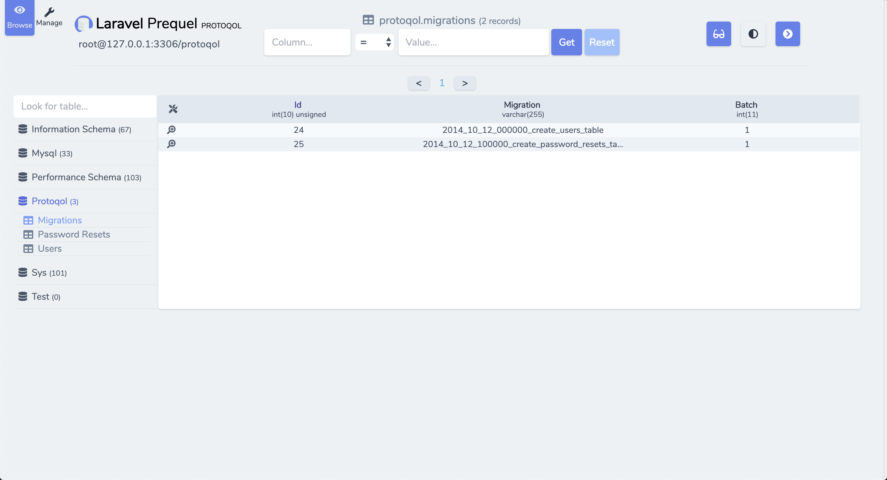
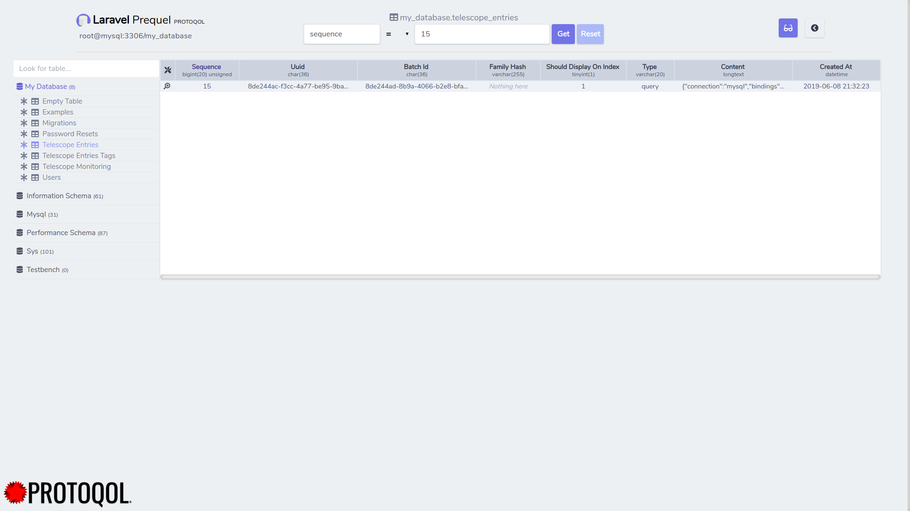

<p align="center">
    <a href="https://packagist.org/packages/protoqol/prequel">	
       
    </a>
    <a href="https://travis-ci.org/Protoqol/Prequel.svg?branch=Dev">
	    	
    </a>
    <a href="https://packagist.org/packages/protoqol/prequel">
	    	
    </a>
    <a href="https://laravel.com/">
	    =5.6-lightblue.svg"/>	
    </a>
    <a href="https://github.com/badges/shields/pulse" alt="Activity">
        
    </a>
    <a href="https://discord.gg/kxkUYqX">
        
    </a>
    <a href="https://twitter.com/intent/follow?screen_name=Protoqol_XYZ">
        
    </a>
</p>

#### What is Prequel exactly?

Prequel is meant to be a database management tool for Laravel to replace the need for separate standalone database tools like phpMyAdmin, Sequel Pro or MySQL Workbench. With its (hopefully) clear and concise UI, Prequel is to be a modern and lightweight database browser/tool ready for the web of the future. Prequel's design is purposefully based on that of [Laravel Telescope](https://github.com/laravel/telescope) because (web-)developers today have enough to learn and master already, so let's help eachother out and make sure to not add anything virtually useless to that huge pile of knowledge.



> Clear and concise database management

### Want to help keep open-source sustainable?

You can help by contributing to the code or donating using the button below!
Both are highly appreciated and contribute directly to keeping open-source free and sustainable!

[](https://www.paypal.com/cgi-bin/webscr?cmd=_s-xclick&hosted_button_id=TJS5BKNE3JGW8)

## Installation

###### To install follow the instructions below.

```bash
$ composer require protoqol/prequel
$ php artisan prequel:install
```

###### When installation and publishing is done navigate to `/prequel` in your browser to see Prequel in action!

## Updating

```bash
$ php artisan prequel:update
```

#### Issues, bugs and feature requests can be reported [here!](https://github.com/Protoqol/Prequel/issues/new/choose)

## Configuration

You might have noticed that, while publishing a config file appeared under `config/prequel.php`.
That configuration file looks something like this.

> Note that you can define `PREQUEL_ENABLED` in your .env file.

```php
<?php

    [

        /*
        |--------------------------------------------------------------------------
        | Prequel Master Switch : boolean
        |--------------------------------------------------------------------------
        |
        | Manually disable/enable Prequel, if in production Prequel will always be
        | disabled. Reason being that nobody should ever be able to directly look
        | inside your database besides you or your dev team (obviously).
        |
        */

        'enabled' => env('PREQUEL_ENABLED', true),


        /*
        |--------------------------------------------------------------------------
        | Prequel Locale : string
        |--------------------------------------------------------------------------
        |
        | Choose what language Prequel should display in.
        |
        */

        'locale' => env('APP_LOCALE', 'en'),


        /*
        |--------------------------------------------------------------------------
        | Prequel Path
        |--------------------------------------------------------------------------
        |
        | The path where Prequel will be residing. Note that this does not affect
        | Prequel API routes.
        |
        */

        'path' => 'prequel',


        /*
        |--------------------------------------------------------------------------
        | Prequel base url
        |--------------------------------------------------------------------------
        |
        | When present, this URL will be used instead of the default url.
        | This should be a complete url excluding tailing slash.
        | Example: 'https://protoqol.nl'
        |
        */
        'baseUrl' => null,
    

        /*
        |--------------------------------------------------------------------------
        | Laravel asset generation suffix and namespace definition
        |--------------------------------------------------------------------------
        |
        | Here you can define your preferred asset suffixes and directory/namespaces.
        | Separate with a double backwards slash to define namespace and directory
        | location. Everything after the last '\\' will be treated as a suffix.
        | Note that the backslash needs to be escaped with an extra backslash
        |
        | For example
        |
        |  Configuration
        |     'suffixes' => [
        |           'model'  => 'Models\\Model',
        |           'seeder' => 'MyMadeUpSeederSuffix'
        |       ]
        |
        |  When generating for `users` table
        |     (directory) app/models/UserModel.php
        |     (qualified class) App\Models\UserModel
        |     (directory) database/seeds/UserMyMadeUpSeederSuffix.php
        |
        */

        'suffixes' => [
            'model'      => 'Models\\',
            'seeder'     => 'Seeder',
            'factory'    => 'Factory',
            'controller' => 'Controller',
            'resource'   => 'Resource',
        ],


        /*
        |--------------------------------------------------------------------------
        | Prequel Database Configuration : array
        |--------------------------------------------------------------------------
        |
        | This enables you to fully configure your database connection for Prequel.
        |
        */

        'database' => [
            'connection' => env('DB_CONNECTION', 'mysql'),
            'host'       => env('DB_HOST', '127.0.0.1'),
            'port'       => env('DB_PORT', '3306'),
            'database'   => env('DB_DATABASE', 'homestead'),
            'username'   => env('DB_USERNAME', 'homestead'),
            'password'   => env('DB_PASSWORD', 'secret'),
	    'socket' 	 => env('DB_SOCKET', ''),
        ],


        /*
        |--------------------------------------------------------------------------
        | Prequel ignored databases and tables : array
        |--------------------------------------------------------------------------
        | Databases and tables that will be ignored during database discovery.
        |
        | Using 'mysql' => ['foo']  ignores only the mysql.foo table.
        | Using 'mysql' => ['*'] ignores the entire mysql database.
        |
        */

        'ignored' => [
            // 'information_schema'  => ['*'],
            // 'sys'                 => ['*'],
            // 'performance_schema'  => ['*'],
            // 'mysql'               => ['*'],
            '#mysql50#lost+found' => ['*'],
        ],


        /*
        |--------------------------------------------------------------------------
        | Prequel pagination per page : integer
        |--------------------------------------------------------------------------
        |
        | When Prequel retrieves paginated information, this is the number of
        | records that will be in each page.
        |
        */

        'pagination' => 100,


        /*
        |--------------------------------------------------------------------------
        | Prequel middleware : array
        |--------------------------------------------------------------------------
        |
        | Define custom middleware for Prequel to use.
        |
        | Ex. 'web', Protoqol\Prequel\Http\Middleware\Authorised::class
        |
        */

        'middleware' => [
            Protoqol\Prequel\Http\Middleware\Authorised::class,
        ],
    ];

```



> Clear and concise database management

## Contributing

See [Contributing](CONTRIBUTING.md) to see how you can contribute to Prequel!

## Contributors

- [Quinten Justus](https://github.com/QuintenJustus)
- [Contributors](https://github.com/Protoqol/Prequel/graphs/contributors)

## License

Prequel is licensed under the MIT License. Please see [License File](LICENSE) for more information.
